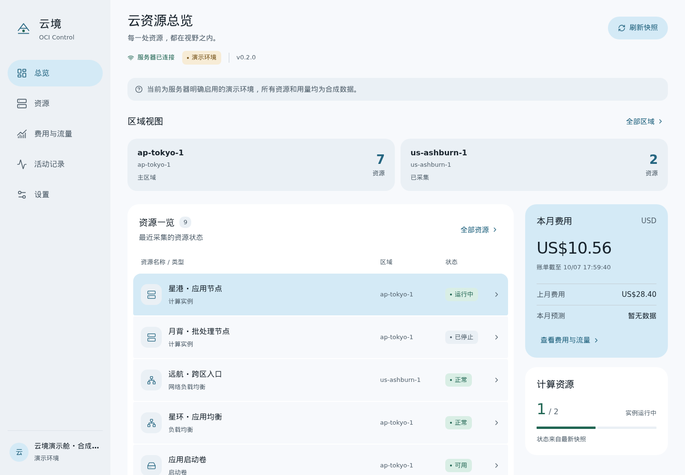

# 云境 · OCI Control

面向个人和小团队的 Oracle Cloud Infrastructure 运维面板。一个自托管 Python 服务、一套中文网页，以及可连接自有服务器的 Android 客户端。独立开源项目，与 Oracle 无隶属关系。

当前版本 **0.2.0**。采用受 Fluxdo 启发的 Material 3 风格，网页与 Android 共用组件，支持跟随系统或手动切换浅色／深色。它将多区域资源、费用与流量观测放在同一界面，并为受支持的操作提供预览、确认与审计。离线时仍可查看带采集时间的历史快照。

[Android 安装包](https://github.com/SkySkin/oci-control/releases) · [中文安装文档](docs/INSTALL.md) · [数据口径与权限](docs/OCI.md)



## 能做什么

- 汇总有权限访问的区域与 compartment，查看实例、负载均衡、存储、网络资源及可用指标；部分采集失败保留已有数据并明确提示。
- 查看月度费用、服务费用、监控流量估算和官方出站原始计量（含零费用用量）；缺失数据保持“未知”，不会伪装成零。
- 在服务端授权范围内启动、停止、重启和重命名实例，启用或停用 NLB 后端；操作必须先预览并确认，危险操作要求输入资源名。
- 网页使用 HttpOnly 会话 Cookie；Android 使用原生 HTTP 和 Keystore 加密保存的会话凭证。OCI API 密钥始终保留在服务端。
- 资源打开独立详情页，返回原页面并恢复列表位置；手机底部导航、桌面侧边导航分别适配。Android 返回键优先关闭弹窗，再返回详情来源和总览。
- 保留按服务器身份隔离的快照；退出撤销当前会话、保留快照，另有“清除本地数据”。离线不能执行或排队云操作。

这不是任意 OCI CLI 执行器，不提供删除实例、任意脚本或任意 OCI 方法调用入口。所有云操作都受 OCI IAM 权限约束。

## 快速开始：原生安装

Linux/macOS 需要 **Python 3.10+（推荐 3.12）和 Node.js 22+**。先从本项目仓库获取并审阅源码，再进入目录：

```bash
git clone https://github.com/SkySkin/oci-control.git
cd oci-control
export OCI_CONTROL_DATA_DIR="$HOME/.local/share/oci-control"
./scripts/install-native.sh
```

脚本会创建 `.venv`、安装 Python 依赖（含 OCI SDK/CLI）、构建网页，并通过不回显的交互输入设置面板密码；不会自动修改 OCI 配置或执行云操作。若尚无 OCI API 配置：

```bash
.venv/bin/oci setup config
```

先为专用 OCI 用户配置最小权限。检查配置文件中的 `key_file` 指向服务器上真实可读的私钥位置；密钥、配置及运行数据都必须放在代码目录之外。参见 [OCI 采集和权限](docs/OCI.md) 与 [官方 CLI 安装文档](https://docs.oracle.com/en-us/iaas/Content/API/SDKDocs/cliinstall.htm)。

本机试用可显式启用 HTTP：

```bash
export OCI_CONTROL_PUBLIC_URL="http://127.0.0.1:8787"
export OCI_CONTROL_ALLOW_HTTP=true
./scripts/run-native.sh
```

打开 `http://127.0.0.1:8787`，用刚设置的面板密码登录。只想先看演示界面时，在启动前设置 `OCI_CONTROL_MODE=demo`；演示数据始终带标记，不连接真实 OCI 资源。

## 快速开始：Docker Compose

镜像多阶段构建网页与 Python 服务，包含 OCI SDK/CLI，以非 root 用户运行。数据持久化在命名卷，OCI 配置目录只读挂载。

先按 [Docker 安装步骤](docs/INSTALL.md#docker-compose) 准备代码目录外的容器专用 OCI 配置；容器内的私钥路径通常为 `/oci/api_key.pem`，需要对 UID `10001` 可读。不要直接修改其他服务正在使用的 OCI 配置。

```bash
export OCI_CONFIG_DIR="$HOME/.config/oci-control/oci"
export OCI_CONTROL_PUBLIC_URL="http://127.0.0.1:8787"
export OCI_CONTROL_ALLOW_HTTP=true
docker compose build
docker compose run --rm oci-control python -m server configure
docker compose up -d
```

Compose 默认只发布到 `127.0.0.1:8787`。局域网/IP 访问需显式设置绑定地址、防火墙和 HTTP 开关；公网推荐使用自有域名 HTTPS。完整的 systemd、反向代理、Cloudflare Tunnel、升级和备份步骤见 [安装文档](docs/INSTALL.md)。

## Android

日常使用请从 [Releases](https://github.com/SkySkin/oci-control/releases) 下载维护者签名的 APK，并核对同一发布中的 SHA256SUMS。正式包使用固定签名与包名 `com.ocicontrol.app`，后续同签名版本可覆盖升级并保留应用数据。

开发测试也可从本仓库 GitHub Actions 的 **Checks and Android APK** 成功运行中下载 `oci-control-0.2.0-debug-apk`。这是 **调试构建**，应用名带“调试版”，包名为 `com.ocicontrol.app.debug`，每次构建不保证相同签名。安装来源需由你在 Android 系统中允许。

应用内填写面板服务地址，例如 `https://oci.example.com`，然后输入面板密码。连接 `http://IP:端口` 时必须确认风险并显式允许：HTTP 上的密码、会话和资源数据没有传输加密，只适合可信网络。Android 上的 `127.0.0.1` 指向手机自身，请使用手机能够访问的服务器地址。

APK 内置网页，不依赖外部网页启动。首次登录后可在网络中断时查看最近快照及采集时间；它不是实时云状态。退出会撤销在线会话并保留本地快照；断网时无法确认撤销，需恢复连接后重试退出。清除本地数据可移除本机保留的快照。正式发布包使用独立包名 `com.ocicontrol.app`：CI 默认另产出 `oci-control-0.2.0-unsigned-release-apk`，由维护者下载后在本地签名，签名私钥不上传 GitHub。未签名 APK 不能直接安装，见 [Android 构建与本地签名](docs/INSTALL.md#android-构建)。

## 费用、免费额度与安全边界

OCI Always Free 的资格、资源形状、区域容量、额度和政策由 Oracle 决定。资源标记不等于费用保证；预算告警也不是硬性消费上限。费用数据可能延迟，监控网络字节不等于精确的实时可计费公网流量，不能将实例、VNIC 与 NLB 指标简单相加。请定期核对 OCI 官方账单和免费额度。

面板密码保护的是本服务；OCI 权限由服务端配置的 API 用户决定。建议专用 API 用户、专用密钥和专用 compartment，先授予读取权限，再按需添加明确操作权限。不要将 tenancy 管理员密钥用于公开面板。配置 HTTPS、及时升级，限制服务网络入口，并在面板审计之外保留 OCI Audit。

运行数据目录含密码摘要、会话记录、快照和审计；应按敏感数据保护，放在仓库之外并限制文件权限。退出不等于清理快照，卸载/清除应用数据会失去本地缓存。不要将配置、私钥、真实账户 OCID、资源 IP、会话、数据库、签名文件或私人部署报告提交到仓库。

## 开发与验证

```bash
python3 -m venv .venv
.venv/bin/python -m pip install -r requirements-dev.txt
.venv/bin/python -m pytest -q
.venv/bin/python -m pytest -q scripts/tests
npm ci --prefix web
npm test --prefix web
npm run build --prefix web
npm ci --prefix mobile
npm test --prefix mobile
npm run sync --prefix mobile
python3 scripts/secret-audit.py
```

测试只使用合成数据，不允许为测试更改真实云资源。Android 原生加密单元测试随 CI 运行；真机 Keystore 测试需另行在测试设备执行。详见 [接口契约](docs/IMPLEMENTATION_CONTRACT.md)、[安装文档](docs/INSTALL.md) 和 [项目协作约束](AGENTS.md)。
